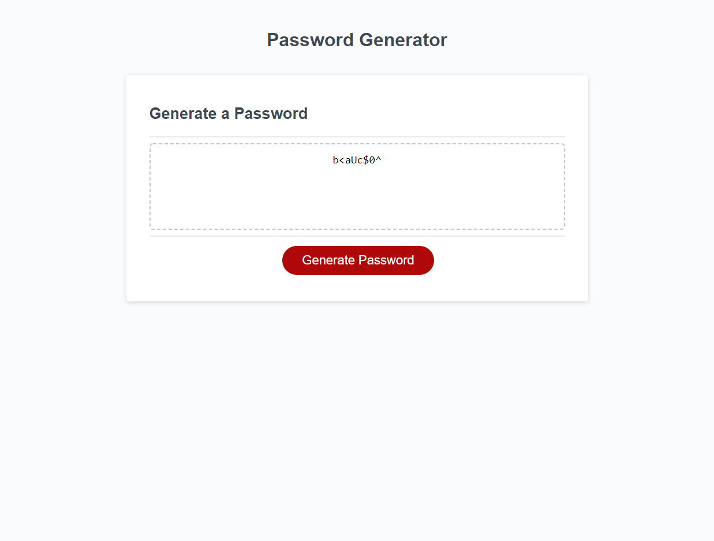

# Password-Generator Homework
* In this homework assignment I made a simple password generator with Javascript for anyone looking to find a randomized password.
    
    # Link to the website:
    [Deployed-Website](https://swagmaster678.github.io/Password-Generator/)
    
    # Link to my repository:
    [My Repository](https://github.com/swagmaster678/Password-Generator)

    # Screenshot of the working web page:
     

 
# Using script.js
* Clicking "Generate Password" will generate a secure password.
* Has series of prompts for password criteria.
* Can choose a length between 8 and 128 characters.
* Can choose between lowercase, uppercase, numeric, and/or special characters.
* Password matches the selected criteria user chooses.